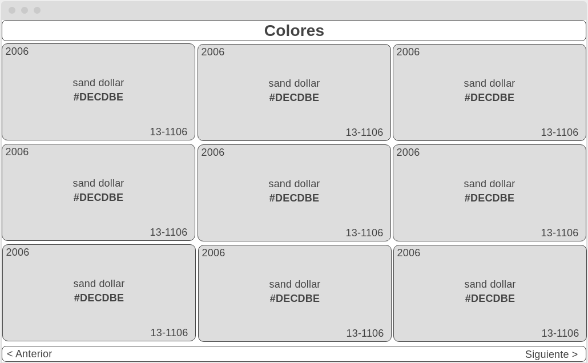

# Administración de colores

## Introduccion de la aplicación
Se requiere un sistema para la administración y la estandarización de los colores que se van a utilizar para páginas web, nuevos diseños, flyers y hasta para redes sociales.

Para que los demás departamentos y diseñadores puedan tener acceso a los colores, se debe de crear una aplicación en la que se puedan administrar y acceder fácilmente.

### Especificaciones:
Los colores tienen los siguientes atributos:


ID: Numérico, ejemplo: 1

Name: String, ejemplo: "Sand Dollar"

Color: String, Ejemplo: "#DECDBE"

Pantone: String, Ejemplo: "13-1106"

Year: Numérico, Ejemplo: 2020


El API debe proveer los siguientes métodos:

```
    GET /colores

    GET /colores/:id

    POST /colores

    PUT /colores/:id

    DELETE /colores/:id
```

Se contará con dos perfiles de acceso al API, usuario y administrador con las siguientes restricciones:

Los métodos POST, PUT y DELETE únicamente pueden ser accesados por el perfil administrador.

Los métodos GET pueden ser accesados tanto por ambos perfiles.

El método de listado de colores debe soportar páginación y debe devolver 6 colores por página.


ADMINISTRADOR: 

Se debe desarrollar una aplicación para la gestión de colores, en esta se podrán listar, crear, actualizar y eliminar los colores de la compañía,

La pantalla de listado de colores debe ser conforme al siguiente wireframe. (Ajustar este despliegue de colores para dispositivos con pantallas pequeñas).
<div align="center">
    <a href="#">
       
    </a>
</div>

Debe permitir acceso a usuarios y administradores (se deben tener en cuenta las restricciones del API).

Esta API también podrá ser accesada por otros servicios (únicamente el listado de colores) que debido a distintos requerimientos necesitarán:

Especificar el número de items que desean por página, para esto se deben recibir este número como parámetro y paginar acordemente, es importante que el API retorne valores importantes como página actual, número de páginas, total de elementos.

Especificar si desean recibir un json o un xml como respuesta.

## Listado de tecnologias y frameworks utilizados
1.- php Version 7.2.x

2.- Node Version 14.x (npm o yarn)

3.- Mysql Version > 5.7

4.- Laravel 8.5.20 (composer)

5.- Vue 2.6.x

# Instalacion de la app
1.- Clonar o descargar la aplicacion

2.- Situarse en la carpeta raiz de la aplicacion

3.- Instalar las dependencias del composer (tener instalado composer en el Sistema Operativo)
```
composer install
```

4.- Instalar las dependencias del node_modules (tener instalado node en el Sistema Operativo)
```
npm install
```

5.- Especificar las variables de entorno para la conexion con la base de datos en el archivo .env, se puede copiar y pegar el archivo .env.example y despues renombrarlo a .env 
```
cp .env.example .env
```

6.- Crear la base de datos especificado en la variable de entorno anteriormente en el gestor de la base de datos(en este caso se utiliza mysql)


7.- Hacer la migracion de la base de datos (crear las tablas)
```
php artisan migrate
```

7.1 Para cargar datos de pruebas ejuctar el siguiente comando
```
php artisan migrate:refresh --seed
```

8.- Probar la aplicacion
```
php artisan serve
```


repositorio del proyecto
https://github.com/rsantiagos/colors
